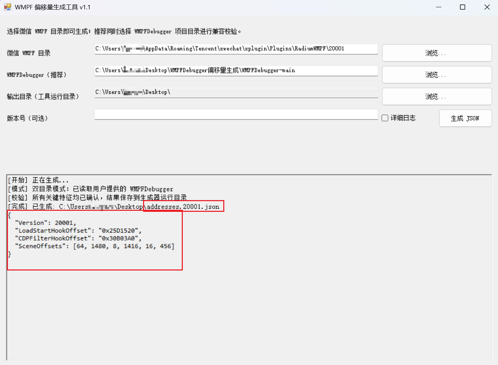
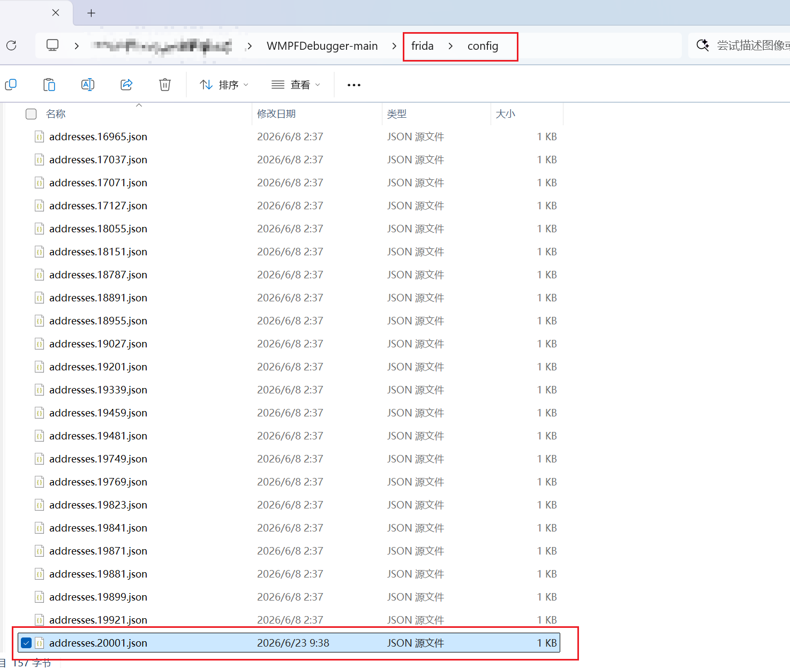

# WMPFOffsetGen.GUI v1.1

感谢大佬的开源 [https://github.com/evi0s/WMPFDebugger](https://github.com/evi0s/WMPFDebugger)，优先推荐使用 [WMPFDebugger](https://github.com/evi0s/WMPFDebugger) 官方工具里的微信地址偏移量。如官方工具未更新微信新版本地址偏移量文件，则可以使用本工具生成对应版本应急使用，具体以大佬 [WMPFDebugger](https://github.com/evi0s/WMPFDebugger) 工具为准。

这是一个 Windows 图形化工具。用户提供微信 WMPF 文件夹后，工具会分析其中的 `flue.dll` 并生成对应版本的：

```text
addresses.<WMPF版本号>.json
```

WMPFDebugger 项目文件夹是可选项，但推荐提供。提供后，工具会额外读取项目当前的 Hook 实现与历史配置进行兼容校验。配置文件固定保存到 WMPFOffsetGen 程序自身的运行目录，不会修改 WMPFDebugger 项目。

## v1.1 更新说明

- 支持两种工作模式：
  - 单目录模式：只选择微信 WMPF 目录，使用生成器内置规则和历史结构样本。
  - 双目录模式（推荐）：同时选择 WMPF 和 WMPFDebugger 项目根目录。
- 自动读取 `WMPFDebugger/frida/hook.js`，确认配置字段和 `SceneOffsets` 数量。
- 自动读取 `WMPFDebugger/frida/config/addresses.*.json`，提取历史结构规律。
- 修复旧版只能读取和输出 3 项 `SceneOffsets` 的问题。
- 修复将日志格式化函数误判为 `AppletIndexContainer::OnLoadStart` 的问题。
- 通过 scene `1101` 比较点和调用链推导发生漂移的新结构偏移。
- 启用严格生成：关键特征无法确认时停止生成，不使用默认值或历史值冒险回退。
- 生成结果固定保存到 EXE 所在目录。
- GUI、程序集、源码目录和发布文件版本统一为 `1.1`。

## 使用方式

1. 双击 `WMPFOffsetGen.GUI.v1.1.exe`。
2. 输入或拖拽 WMPF 目录：

```text
C:\Users\%当前用户%\AppData\Roaming\Tencent\xwechat\xplugin\Plugins\RadiumWMP\
```

3. 推荐选择 WMPFDebugger 项目根目录；也可以留空。
4. 点击“生成 JSON”。
5. 校验通过后，在生成器运行目录获得 `addresses.<版本号>.json`。



6. 用户确认结果后，可自行将 JSON 复制到 WMPFDebugger 的 `frida/config`。



双目录模式下，也可以将两个目录同时拖入窗口，工具会根据 `frida/hook.js` 自动区分。

### 单目录模式

只提供 WMPF 目录时，工具使用内置的 6 项 Hook 规则以及多个历史版本的 `SceneOffsets` 结构样本。工具仍会重新分析当前 `flue.dll`，不会直接复制某个旧版本 JSON。

### 双目录模式（推荐）

同时提供 WMPFDebugger 后，工具会在单目录分析基础上：

- 校验实际 `frida/hook.js` 需要的配置结构。
- 合并项目 `frida/config` 中的历史偏移样本。
- 检查生成结果是否兼容用户正在使用的 WMPFDebugger。

### WMPF 目录支持

可以选择以下任一层级：

```text
20001
20001\extracted
20001\extracted\runtime
20001\extracted\runtime\flue.dll
```

### 可选的 WMPFDebugger 目录要求

所选项目根目录必须包含：

```text
WMPFDebugger
└─ frida
   ├─ hook.js
   └─ config
      └─ addresses.*.json
```

## 目录结构

- `src/WmpfOffsetGenGui.cs`：GUI、PE 分析算法和 CLI 模式完整源码。
- `docs/WMPFOffsetGen.GUI.源码与使用说明.md`：算法与严格校验说明。
- `build-gui.bat`：Windows 一键编译脚本。
- `dist/WMPFOffsetGen.GUI.v1.1.exe`：编译后的发布程序。

## 编译

双击或执行：

```bat
build-gui.bat
```

输出：

```text
dist\WMPFOffsetGen.GUI.v1.1.exe
```

环境要求：

- Windows x64
- .NET Framework 4.x
- `%WINDIR%\Microsoft.NET\Framework64\v4.0.30319\csc.exe`

## 未来版本说明

对于 `20005`、`20035` 等后续 WMPF，若关键字符串、函数关系和 scene 结构只是小幅漂移，工具可以自动推导新配置。

如果微信删除关键字符串、内联或拆分目标函数，或 WMPFDebugger 改变 Hook 配置格式，工具会安全停止并提示需要更新分析规则，不会承诺对所有未来版本自动生成。

## 版本

- 工具版本：1.1
- 程序版本：1.1
- 已验证 WMPF：20001
- 发布文件：`WMPFOffsetGen.GUI.v1.1.exe`
